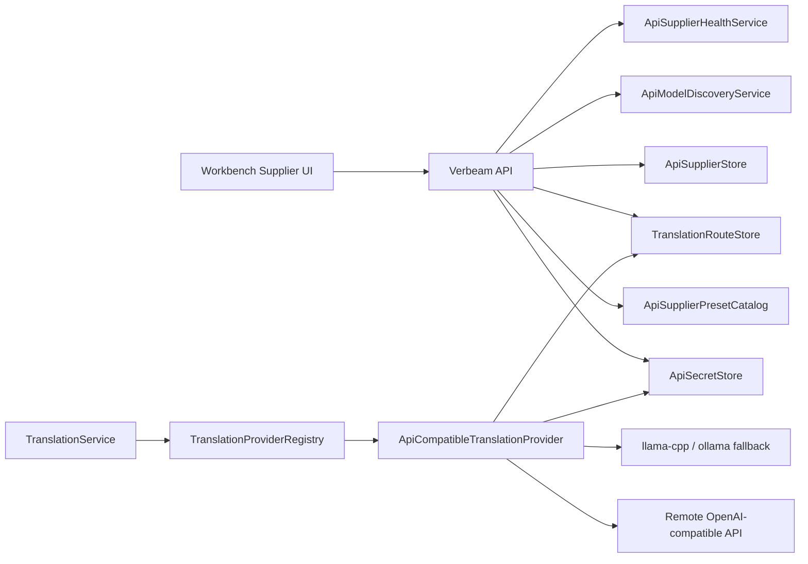

# API Supplier Design

This document designs Verbeam's API supplier layer for remote model providers.
It borrows the useful parts of CC Switch's provider workflow: preset-first setup,
provider cards, one-click activation, model auto-fetch, health display, and a
small beginner-facing recommendation surface.

## Goals

- Let beginner users add a remote API provider by choosing a preset and pasting
  an API key.
- Keep the translation runtime stable by separating protocol providers from
  upstream suppliers.
- Support new upstream models without requiring an app release.
- Show only one primary recommendation plus two alternatives in beginner UI.
- Keep local runtimes (`llama-cpp`, `ollama`) as explicit fallback paths.
- Store API keys outside plaintext JSON.

## Non-Goals

- Do not build a full local proxy router in v1.
- Do not support every native protocol in v1. Start with OpenAI-compatible Chat
  Completions.
- Do not auto-recommend unknown newly discovered models as primary choices.
- Do not implement custom JavaScript quota scripts in v1.
- Do not mix supplier credentials into `models.catalog.json`.

## Core Terms

```text
Runtime Provider
  The Verbeam integration that knows how to send a translation request.
  Examples: ollama, llama-cpp, api-compatible.

API Supplier
  A user-configured upstream account or endpoint.
  Examples: DeepSeek account, OpenRouter account, SiliconFlow account, custom
  OpenAI-compatible server.

Supplier Preset
  A remotely updatable template describing endpoint defaults, protocol, model
  discovery behavior, model metadata, and optional balance templates.

Route
  The active translation path: runtime provider + supplier + model + fallbacks.
```

The important design decision is:

```text
DeepSeek / OpenRouter / SiliconFlow are suppliers, not Verbeam runtime
providers.
```

Verbeam should add one remote runtime provider first:

```text
provider: api-compatible
protocol: openai_chat
```

That provider reads an active supplier profile and sends requests to its
configured upstream endpoint.

## Architecture



## Catalogs

### `api-suppliers.catalog.json`

This is the remote-updatable supplier preset catalog. It should live beside
`models.catalog.json` and use the same built-in + cache loading pattern.

```json
{
  "schemaVersion": 1,
  "catalogVersion": "2026-06-11-built-in",
  "minAppVersion": "",
  "expiresAt": "2026-07-11T00:00:00Z",
  "presets": [
    {
      "id": "deepseek",
      "displayName": "DeepSeek",
      "category": "official",
      "websiteUrl": "https://platform.deepseek.com",
      "apiKeyUrl": "https://platform.deepseek.com/api_keys",
      "protocol": "openai_chat",
      "baseUrl": "https://api.deepseek.com",
      "modelsUrl": "",
      "requiresApiKey": true,
      "apiKeyHeader": "Authorization",
      "apiKeyScheme": "Bearer",
      "supportsModelFetch": true,
      "supportsBalance": true,
      "balanceTemplate": "deepseek-balance",
      "defaultModel": "deepseek-chat",
      "recommendedModels": [
        {
          "id": "deepseek-chat",
          "displayName": "DeepSeek Chat",
          "tier": "quality",
          "recommendedUse": "higher quality remote translation",
          "qualityScore": 0.84,
          "latencyScore": 0.58,
          "contextScore": 0.82,
          "stabilityScore": 0.76,
          "languagePairs": ["ja->zh-TW", "en->zh-TW", "*"],
          "bestFor": ["quality", "web_article", "subtitle"]
        }
      ]
    }
  ]
}
```

Preset rules:

- `protocol` must be explicit. v1 allows only `openai_chat`.
- `baseUrl` is a service root or OpenAI-compatible version root.
- `modelsUrl` is optional and overrides derived model discovery URLs.
- `recommendedModels` is curated metadata. It does not need to contain every
  upstream model.
- New discovered models can be displayed as advanced choices, but unknown models
  should not become the beginner primary recommendation.

### Local Supplier Store

Local user suppliers should be stored in SQLite or a small JSON file under
`data/`, but secrets must not be inline.

```json
{
  "id": "supplier_01JZ...",
  "presetId": "deepseek",
  "name": "My DeepSeek",
  "protocol": "openai_chat",
  "baseUrl": "https://api.deepseek.com",
  "modelsUrl": "",
  "apiKeyRef": "verbeam://secret/api-suppliers/supplier_01JZ/api-key",
  "activeModel": "deepseek-chat",
  "modelCatalog": [
    {
      "id": "deepseek-chat",
      "displayName": "DeepSeek Chat",
      "ownedBy": "deepseek",
      "source": "fetched",
      "fetchedAt": "2026-06-11T00:00:00Z"
    }
  ],
  "lastHealth": {
    "status": "ready",
    "latencyMs": 420,
    "checkedAt": "2026-06-11T00:00:00Z",
    "message": ""
  },
  "createdAt": "2026-06-11T00:00:00Z",
  "updatedAt": "2026-06-11T00:00:00Z"
}
```

## Secrets

Add `ApiSecretStore`.

v1 behavior:

- Windows: protect secrets with DPAPI or Windows Credential Manager.
- Test/runtime fallback: allow an in-memory store for tests.
- JSON/SQLite stores only `apiKeyRef`, never the raw key.
- API responses return `hasApiKey: true`, not the key.

## Runtime Provider

Add `ApiCompatibleTranslationProvider`.

Descriptor:

```json
{
  "name": "api-compatible",
  "displayName": "API Provider",
  "kind": "remote-llm",
  "defaultModel": "",
  "requiresNetwork": true,
  "isLocal": false
}
```

Request behavior:

```text
TranslationService
-> provider api-compatible
-> active route
-> supplier profile
-> OpenAI Chat Completions request
-> parse response text
-> return engine api-compatible:<supplierId>:<model>
```

Default sampling for translation:

```json
{
  "temperature": 0,
  "max_tokens": 256,
  "timeoutSeconds": 30
}
```

Request body shape:

```json
{
  "model": "deepseek-chat",
  "temperature": 0,
  "max_tokens": 256,
  "messages": [
    { "role": "system", "content": "stable translation prompt" },
    { "role": "user", "content": "OCR text and suffix context" }
  ]
}
```

## Model Discovery

Add `ApiModelDiscoveryService`.

Inputs:

- `baseUrl`
- optional `modelsUrl`
- `isFullUrl`
- API key
- timeout

Candidate URL rules:

```text
1. If modelsUrl is set, use it exactly.
2. If baseUrl ends with /vN, call {baseUrl}/models.
3. Otherwise call {baseUrl}/v1/models.
4. If baseUrl is a full endpoint, derive the service root and call /v1/models.
5. If known compatibility suffixes are present, strip them and retry /v1/models
   and /models.
```

Error classification:

| Status | UI Message |
| --- | --- |
| 401/403 | API key is invalid or lacks permission. |
| 404/405 | This supplier does not expose model discovery. Manual model input is allowed. |
| Timeout | Endpoint is slow or unreachable. |
| Parse failure | Endpoint is not OpenAI-compatible. |
| Empty data | Fetch succeeded but no models were returned. |

Fetched models should be cached in the local supplier profile with `fetchedAt`.
They should not overwrite curated recommendation metadata.

## Recommendation Logic

Beginner UI should always show:

```text
Primary recommendation: 1
Alternatives: 2
Advanced model list: collapsed
```

Candidate sources:

1. Curated `recommendedModels` from supplier preset.
2. Known global model metadata from `models.catalog.json` or a future
   `remote-models.catalog.json`.
3. Fetched unknown models, classified as `unknown`.

Unknown fetched models:

- Can be shown in advanced list.
- Can be manually selected.
- Should not be primary recommendation unless the user explicitly used it
  before and it has successful health/timing history.

Scoring inputs:

```text
workload: realtime_overlay | subtitle | web_article | document
preference: speed | balanced | quality | cost
language pair
observed latency
known quality tier
context window
health status
quota/balance status if available
```

Remote supplier recommendation should include local fallback details:

```json
{
  "provider": "api-compatible",
  "supplierId": "supplier_01JZ",
  "model": "deepseek-chat",
  "fallback": [
    "llama-cpp:verbeam-mort-qwen2.5-0.5b",
    "ollama:verbeam-mort-qwen2.5-0.5b:latest"
  ]
}
```

## Active Route

Add `TranslationRouteStore`.

```json
{
  "profileId": "default",
  "provider": "api-compatible",
  "supplierId": "supplier_01JZ",
  "model": "deepseek-chat",
  "fallback": [
    {
      "provider": "llama-cpp",
      "model": "verbeam-mort-qwen2.5-0.5b"
    },
    {
      "provider": "ollama",
      "model": "verbeam-mort-qwen2.5-0.5b:latest"
    }
  ],
  "updatedAt": "2026-06-11T00:00:00Z"
}
```

Translation failure behavior:

```text
1. Try active remote route.
2. If auth failure, do not retry remote. Mark supplier auth_error.
3. If timeout/network/server error, apply circuit breaker.
4. Try fallback chain in order.
5. Record engine and fallback reason in TranslationEvent metadata.
```

Circuit breaker v1:

- Open after 3 consecutive transient failures.
- Stay open for 60 seconds.
- Show card status `degraded` or `unavailable`.
- Manual "Test" closes the breaker if successful.

## API Endpoints

Supplier presets:

```http
GET  /translation/api-supplier-presets
POST /translation/api-supplier-presets/refresh
```

User suppliers:

```http
GET    /translation/api-suppliers
GET    /translation/api-suppliers/{id}
POST   /translation/api-suppliers
PUT    /translation/api-suppliers/{id}
DELETE /translation/api-suppliers/{id}
```

Supplier operations:

```http
POST /translation/api-suppliers/{id}/test
POST /translation/api-suppliers/{id}/models/fetch
GET  /translation/api-suppliers/{id}/models
POST /translation/api-suppliers/{id}/activate
```

Active route:

```http
GET /translation/routes/active
PUT /translation/routes/active
```

Provider compatibility:

```http
GET /providers
GET /translation/models?provider=api-compatible
GET /translation/model-recommendation?provider=api-compatible
```

`/translation/models?provider=api-compatible` should list models from the
active supplier when one exists. If no supplier exists, it returns an empty list
plus recommended setup hints in a future response envelope. The current endpoint
returns an array, so v1 can keep the array behavior and let the UI call
`/translation/api-suppliers` for setup state.

## UI Design

### Settings Navigation

Add a dedicated section:

```text
Settings
  Translation
  Model Recommendation
  API Suppliers
  Local Runtimes
```

### API Suppliers Screen

Default empty state:

```text
No API supplier added
[Add API Supplier]
```

Add flow:

```text
1. Choose preset
2. Paste API key
3. Test connection
4. Fetch models
5. Choose recommendation
6. Save and use
```

Beginner fields:

- Preset
- Name
- API key
- Model recommendation result

Advanced collapsed fields:

- Base URL
- Models URL
- Full endpoint mode
- Manual model ID
- Timeout

### Supplier Card

Each card should show:

```text
Display name
Preset/category badge
Active / inactive
Health: ready, checking, auth error, unreachable, degraded
Current model
Latency
Balance/quota if available
Actions: Activate, Test, Fetch Models, Edit, Delete
```

Visual states:

| State | Meaning |
| --- | --- |
| Active | Current route uses this supplier. |
| Ready | Last health check succeeded. |
| Needs key | Missing API key. |
| Auth error | 401/403. |
| Unreachable | Network, DNS, timeout, or 5xx. |
| Model stale | Model list not fetched or older than preset/catalog TTL. |

### Recommendation Card

For a beginner:

```text
Recommended: DeepSeek Chat
Best for: higher quality remote translation
Reason: This supplier is reachable, supports your language pair, and is safer
for longer text than the tiny local model.
Status: API key verified
Button: Use this model

Alternatives:
- Local llama.cpp Qwen2.5 0.5B
- Ollama Qwen2.5 1.5B
```

Never show a list of 30 models by default. Put the full list behind
"Advanced models".

## Balance and Usage

v1 should keep balance simple:

- Presets may include a built-in `balanceTemplate`.
- The UI only shows balance after the user explicitly enables it, unless the
  supplier has an unambiguous official query.
- Balance failure should not block translation.
- Usage/timing from translation responses should be stored for later
  recommendation calibration.

## Database Tables

If using SQLite, add these tables:

```sql
CREATE TABLE api_suppliers (
    id TEXT PRIMARY KEY,
    preset_id TEXT NOT NULL,
    name TEXT NOT NULL,
    protocol TEXT NOT NULL,
    base_url TEXT NOT NULL,
    models_url TEXT NOT NULL DEFAULT '',
    api_key_ref TEXT NOT NULL DEFAULT '',
    active_model TEXT NOT NULL DEFAULT '',
    model_catalog_json TEXT NOT NULL DEFAULT '[]',
    health_json TEXT NOT NULL DEFAULT '{}',
    metadata_json TEXT NOT NULL DEFAULT '{}',
    created_at TEXT NOT NULL,
    updated_at TEXT NOT NULL
);

CREATE TABLE translation_routes (
    profile_id TEXT PRIMARY KEY,
    provider TEXT NOT NULL,
    supplier_id TEXT NOT NULL DEFAULT '',
    model TEXT NOT NULL DEFAULT '',
    fallback_json TEXT NOT NULL DEFAULT '[]',
    updated_at TEXT NOT NULL
);
```

If v1 chooses JSON first, keep the same logical shape so moving to SQLite is a
mechanical migration later.

## Implementation Plan

### Phase 1: Data and Catalog

- Add `ApiSupplierPresetCatalog` models and validation.
- Add built-in `api-suppliers.catalog.json`.
- Add cache/refresh service using the same pattern as `ModelCatalogService`.
- Add tests for preset schema, protocol validation, and remote refresh disabled
  behavior.

### Phase 2: Local Supplier Store and Secrets

- Add `ApiSupplierStore`.
- Add `ApiSecretStore` with Windows protected implementation and in-memory test
  implementation.
- Add CRUD endpoints.
- Add tests ensuring API keys are never returned.

### Phase 3: Discovery and Health

- Add `ApiModelDiscoveryService`.
- Add `ApiSupplierHealthService`.
- Add `/models/fetch` and `/test` endpoints.
- Add error classification tests for 401/403, 404/405, timeout, and parse
  failure.

### Phase 4: Runtime Provider

- Add `ApiCompatibleTranslationProvider`.
- Add `TranslationRouteStore`.
- Register `api-compatible` in `TranslationProviderRegistry`.
- Wire active route and fallback chain into `TranslationService`.
- Add tests for request body, auth header, timeout, response parsing, and engine
  naming.

### Phase 5: Recommendation and UI

- Extend recommendation catalog to include remote supplier candidates.
- Add API Suppliers UI section.
- Add beginner setup flow and provider cards.
- Keep advanced model list collapsed.
- Add API tests for `api-compatible` models and recommendations.

## Test Plan

Catalog:

- Loads built-in supplier presets.
- Rejects missing protocol, unsupported protocol, empty base URL, and invalid
  category.
- Remote cache does not override newer built-in schema.

Secrets:

- Saving supplier with an API key stores only `apiKeyRef`.
- GET endpoints never return raw key.
- Updating supplier without a new key keeps the existing key.

Discovery:

- Builds `/v1/models` and `/models` candidate URLs correctly.
- Uses `modelsUrl` override exactly.
- Classifies auth, unsupported endpoint, timeout, parse, and empty-list errors.

Runtime:

- Sends OpenAI Chat Completions request with `temperature=0`.
- Uses configured supplier model.
- Parses `choices[0].message.content`.
- Records `api-compatible:<supplierId>:<model>` engine.
- Applies fallback chain on transient failures.
- Does not retry remote after auth failure.

UI/API:

- `/providers` includes `api-compatible`.
- `/translation/api-suppliers` returns cards without secrets.
- `/translation/models?provider=api-compatible` uses the active supplier.
- Recommendation returns one primary plus two alternatives.

## Open Questions

- Should supplier profiles be per global app or per translation profile/game?
  Recommendation: global supplier credentials, per-profile active route.
- Should v1 use SQLite or JSON for supplier storage?
  Recommendation: SQLite if adding route history soon; JSON is acceptable if we
  need the smallest first implementation.
- Should balance queries be enabled by default?
  Recommendation: no, except for unambiguous official APIs.
- Should `api-compatible` support OpenAI Responses API in v1?
  Recommendation: no. Add `openai_responses` as a second protocol after the
  chat path is stable.
